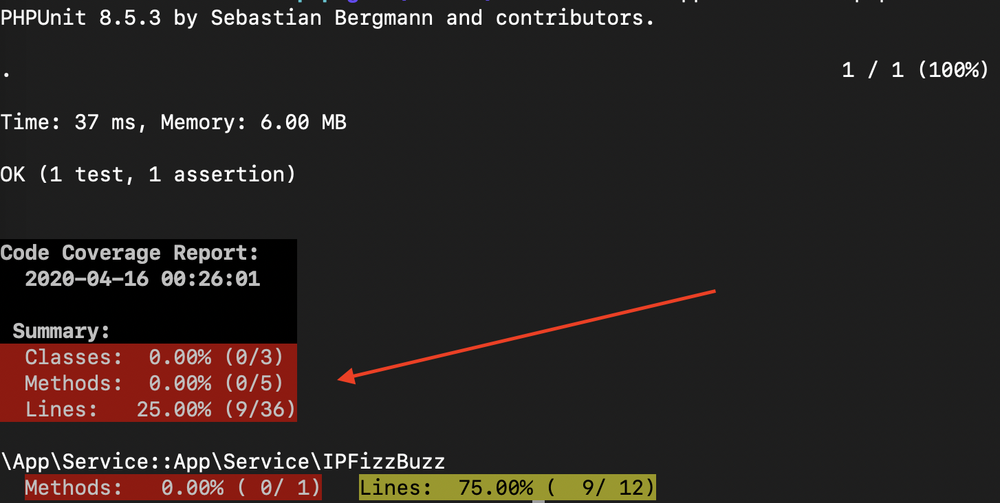

# Testes Unitarios em PHP

#### Como instalar e rodar tests

```bash
./composer.phar install
./vendor/bin/phpunit --colors tests
```

#### Objetivo

Criar testes para todas as classes `App\Service`. Siga o documento [Guide.md](Guide.md) para saber a melhor ordem de estudo.
Cada teste cobre partes das suas classes `App\Service`, o objetivo seria chegar a 100% de cobertura para fins de estudo. Você pode acompanhar sua porcentagem de cobertura através da pagina do [github actions](https://github.com/cloudson/treinando-unit-tests-php/actions).



Se você quiser rodar o projeto e ver cobertura na sua maquina local, o modo mais fácil é via docker. 

```
docker build . -t app 
docker run app vendor/bin/phpunit --whitelist ./src/Service --coverage-text --colors ./tests
```
#### Respostas

As respostas estão na branch respostas, inicialmente faça os testes nas classes faltantes. Dado que esteja feito, podera corrigir.
